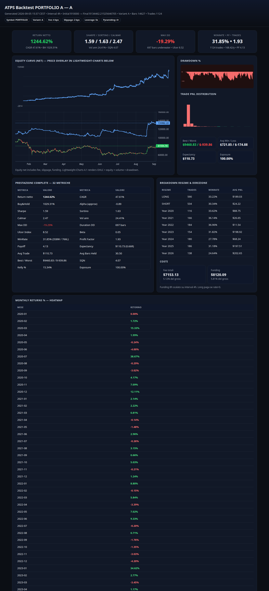
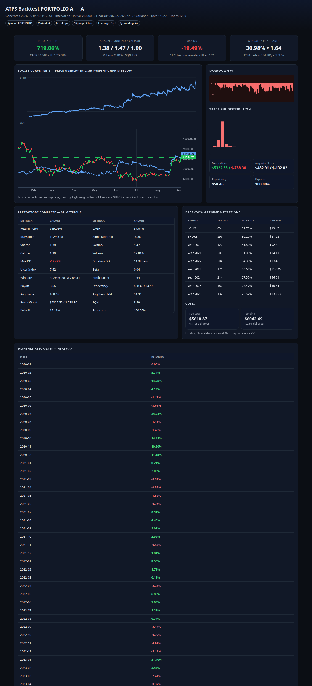
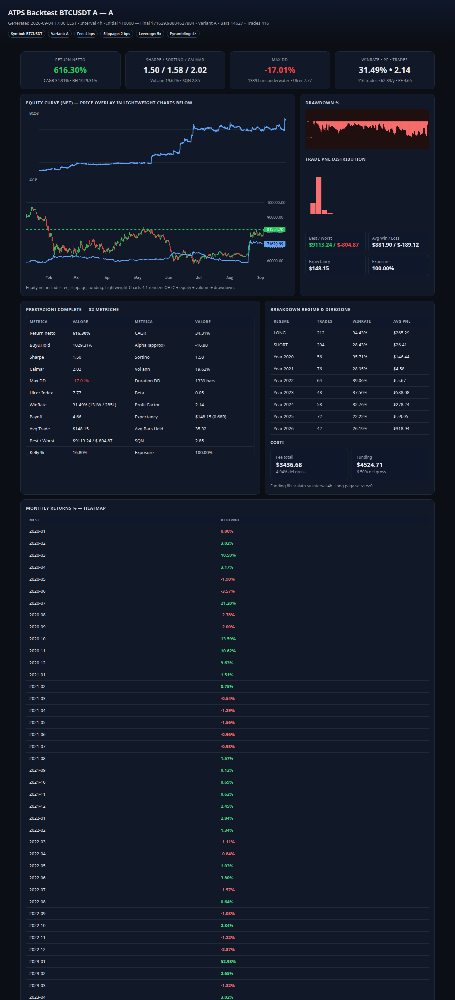

# ATPS — Adaptive Turtle Perpetual System (Go)

Framework quantitativo perpetuo: **Binance dati, Orderly esecuzione**.

[](https://github.com/eleonoraandrea/turtle-extended/releases) [](reports/V5_VALIDATION.md) [](reports/V5_VALIDATION.md)

> Variant A classic Turtle → B + regime → C + funding/OI/volume → D full adaptive (breakout 20/55/100, ATR, ADX, EMA 50/200, vol regime, crash brake, pyramiding, trailing chandelier, vol-targeting). Report HTML MT4-style dettagliato, self-contained, Lightweight-Charts 4.1.

> **Prima volta? → [Guida Avvio completa → docs/GUIDA_AVVIO.md](docs/GUIDA_AVVIO.md)** — clona, build, dati reali, backtest, TUI, bot live paper/live.

## 📦 Download — packages per tutte le versioni

Binari precompilati (backtest+TUI+paper bot e bot live `atps-live`) per **Linux e Windows**, con config validati, report e immagini:

| Versione | Descrizione | Linux | Windows |
|---|---|---|---|
| **v5.0.0** ⭐ | Portfolio finale BTC+ETH+SOL r1.8% + funding veto — **47.61% CAGR / -19.29% DD** | [tar.gz](../../releases/download/v5.0.0/atps_v5_linux_amd64.tar.gz) | [zip](../../releases/download/v5.0.0/atps_v5_windows_amd64.zip) |
| v3.0.0 | Single-symbol H4 winner (sma300 atr1.6) — 43.42% CAGR, test Calmar 3.04 | [tar.gz](../../releases/download/v3.0.0/atps_v3_linux_amd64.tar.gz) | [zip](../../releases/download/v3.0.0/atps_v3_windows_amd64.zip) |
| v4.0.0 | Portfolio baseline risk 2% — 37.04% CAGR | [tar.gz](../../releases/download/v4.0.0/atps_v4_linux_amd64.tar.gz) | [zip](../../releases/download/v4.0.0/atps_v4_windows_amd64.zip) |
| v2.0.0 | Baseline storica validata — 34.31% CAGR | [tar.gz](../../releases/download/v2.0.0/atps_v2_linux_amd64.tar.gz) | [zip](../../releases/download/v2.0.0/atps_v2_windows_amd64.zip) |

Tutte le release: **[github.com/eleonoraandrea/turtle-extended/releases](../../releases)** — ogni package contiene `atps`, `atps-live`, `configs/`, `reports/` e `VERSION-*.md` con quickstart. macOS: build da sorgente (`go build ./cmd/atps`).

## 📈 Backtest — immagini

**v5 — Portfolio BTC+ETH+SOL (risk 1.8% + funding veto): 47.61% CAGR, MaxDD -19.29%, Sharpe 1.59, $10k → $134k**



**v4 — Portfolio baseline (risk 2%): 37.04% CAGR, MaxDD -19.49%**



**v2 — BTC single-symbol baseline: 34.31% CAGR, MaxDD -17.01%**



Altri report in immagini: [v2 ETH](docs/img/v2_eth_a.png) · [v2 SOL](docs/img/v2_sol_a.png) — report completi interattivi in [`reports/*.html`](reports/) (self-contained, apribili offline).

## 🚀 Broker live — Kerben (Orderly Network)

Per l'esecuzione live il bot usa Orderly Network. **Apri un conto su Kerben con il mio referral:**

> ### 👉 [**kerben.trader/?ref=EZIO**](https://kerben.trader/?ref=EZIO) — ref **EZIO**

Setup live dopo la registrazione: `ORDERLY_ACCOUNT_ID=... ORDERLY_KEY=... ORDERLY_SECRET=... ./atps-live live --live --i-understand-live --symbol BTCUSDT --variant A` (dettagli in [docs/LIVE_EXECUTION_SPEC.md](docs/LIVE_EXECUTION_SPEC.md)). **Paper di default** — il live richiede flag espliciti.

## Quickstart — TUI

```bash
go mod tidy
./atps tui                          # TUI interattiva: seleziona simbolo/variante, vedi KPI + sparkline + trades
# oppure CLI diretta:
make demo        # sintetico A/B/C/D → reports/demo_*.html + reports/comparison.html
make backtest    # BTCUSDT D → reports/BTCUSDT_D_*.html
make compare     # A/B/C/D × BTC/ETH/SOL
./atps backtest --variant D --symbol BTCUSDT --out reports/report.html
```

TUI comandi: `Tab` focus, `↑/↓` seleziona, `Enter` esegui, `r` Run, `c` Compare, `o` apri HTML, `?` Help, `q` Esci.

Report dal TUI: `reports/TUI_*.html` self-contained, apribile `file://`.

Serve report:
```bash
make report-serve   # http://localhost:8000
xdg-open reports/TUI_BTCUSDT_D_*.html
```

## Dati reali Binance

```bash
./atps download --symbol BTCUSDT --interval 4h --start 2020-01-01 --funding=true --oi=true
./atps download --symbol ETHUSDT --interval 4h --funding=true --oi=true
./atps download --symbol SOLUSDT --interval 4h --funding=true --oi=true
# output: data/raw/BTCUSDT_4h.csv (OHLCV + funding+OI allineati) + data/cache
```

Endpoints Binance pubblici usati:
- `GET /fapi/v1/klines?symbol=BTCUSDT&interval=4h&limit=1500` paginato
- `GET /fapi/v1/fundingRate?symbol=BTCUSDT&limit=1000` storico 8h
- `GET /futures/data/openInterestHist?symbol=BTCUSDT&period=4h&limit=500` (sumOpenInterest notional)

Visione bulk alternativa per storia lunga: `https://data.binance.vision`

## Backtest

```bash
./atps backtest --variant D --symbol BTCUSDT --csv data/raw/BTCUSDT_4h.csv --out reports/BTC_D.html
./atps compare --symbols BTCUSDT,ETHUSDT,SOLUSDT --variants A,B,C,D --out reports/comparison.html
./atps walk-forward --symbol BTCUSDT --variant D --folds 8
./atps montecarlo --symbol BTCUSDT --variant D --runs 2000
```

Costi: `fee 4 bps + slippage 2 bps` (cfg `costs.fee_bps/slippage_bps`), funding 8h scalato su interval, heat max 6%.

## Risk Engine — 2% max, sizing per |entry-stop|, leva dinamica, satellite 30% skew

```
qty = (equity × risk%) / |entry − stop|   ← SCALA con equity (compounding)
risk% = base 1.0% → min 0.25% (high vol/DD) → max 2.0% (low vol) → heat 3%/2% → Kelly
lev = notional / equity                    ← DERIVATA, mai fissa (hard cap 5×)
```

`internal/risk/risk.go` + `configs/default.yaml` (user spec):
```yaml
risk: {base: 0.01, min: 0.0025, max: 0.02}          # 1% base, 0.25% min, 2% max
portfolio: {max_open_risk: 0.03, max_correlated_risk: 0.02} # 3% totale, 2% correlati
leverage: {max: 5}  # hard cap
pyramiding: {enabled: true, max_additions: 4, risk_neutral: true} # non aumenta heat
profit: {trailing: true, satellite: {enabled: true, allocation: 0.30}} # 70% core Don20, 30% sat Don55 → skew
```
Cap dinamico leva: vol regime>80 ×0.70 / >60 ×0.85 / <20 ×1.30, ADX<20 ×0.80, funding|z|>2.5 ×0.85. Heat totale/correlati, drawdown adaptive (dd 10%→25% → risk → min, non 0), vol target 50% ann.

Audit per trade in HTML: `Lev× Risk% R-multiple` + sizing log. Invariante test: stop perdente **R ≥ -1.8** (mai più del budget).

Obiettivo max: **Expectancy × Positive Skew × Compounding** — 55-65 perdite -1R, 20-30 small +0.5/+2R, 5-10 large +5/+90R (BTC A: mean R 2.49, median -1.0, skew 3.96).

Motore: bar-by-bar, fill **next open** anti look-ahead, stop intrabar (low ≤ stop), trailing chandelier/donchian, pyramiding 0.5 ATR max 4, crash brake flat 24h se drop 4h ≥8%.

## Performance verificata (2026-09-05, engine post-fix — **v5 è la config finale**)

Numeri riproducibili con un comando — validazione completa in `reports/V5_VALIDATION.md`:

```bash
./atps portfolio-backtest --config configs/atps_v5.yaml --out reports/V5_PORTFOLIO.html
./atps backtest --config configs/atps_v3.yaml --variant A --symbol BTCUSDT --csv data/raw/BTCUSDT_4h.csv
```

| Sistema | CAGR | MaxDD | Sharpe | Test-window CAGR/Calmar | Trades |
|---|---|---|---|---|---|
| v2 BTC (vecchia baseline) | 34.31% | -17.01% | 1.50 | 12.4 / 0.73 | 416 |
| v4 portfolio r2% (baseline) | 37.04% | -19.49% | 1.38 | 26.97 / 1.64 | 1230 |
| **v3 BTC H4** (sma300 atr1.6) | **43.42%** | **-14.31%** | **1.73** | **38.06 / 3.04** | 374 |
| **v5 portfolio finale** (r1.8% + funding veto 2.5) | **47.61%** | **-19.29%** | **1.59** | **42.24 / 2.29** | 1124 |

Validazione v5: WF portfolio 8/8 fold positivi (mediana Sharpe 1.44), perturb ±20% tutti
profittevoli, MC 2000 probProfit 100% (p5 +463%), ETH/SOL confermati senza ri-ottimizzazione.
$10k → $134k (2020-01→2026-09), fee+funding inclusi ($7.2k + $8.1k).
Extra validati 2026-09-05: `funding_veto_z: 2.5` (veto entry su funding estremo contro
posizione — train-dominante, test neutrale). Bocciati: btc_filter ON (test Cal 1.65 o
DD -21.2%), satellite chandelier, intrabar H4, re-entry H4, portfolio 7 simboli.

### Evidenza negativa H1 (2026-09-05, focus richiesto utente)

- **Breakout H1** (griglia 2304/simbolo, periodi calendar-scaled ×4): BTC test Cal 0.36,
  SOL 0.33, portfolio H1 DD test -26.2% → BOCCIATO. ETH marginale (Cal 1.01 ≪ H4 2.89).
- **Mean reversion H1** (variante M nuova, griglia 2304/simbolo): tutti i top
candidate test-window NEGATIVI (Cal -0.08…-0.50) → edge assente in questo regime.
- **Portfolio 7 simboli H4** (+BNB/XRP/DOGE/LINK): DD -27.4% per correlazione invernale → BOCCIATO.

Conclusione: su crypto majors 2020-2026 l'H4 domina l'H1 dopo i costi (fee 4bps +
slippage 2bps + funding). L'infrastruttura H1 (dati 58k barre, variante M, periodi
configurabili) resta disponibile per futuri edge (funding carry, execution overlay).

### Tentativi di scala bocciati (cicli precedenti)

| Candidato | Full CAGR/DD | Holdout test (CAGR/Calmar) | Esito |
|---|---|---|---|
| risk-4% (tetti coordinati) | 39.49% / -19.49% | 7.16 / 0.30 vs v2 12.4 / 0.73 | BOCCIATO: amplifica le perdite nel regime chop 2024-26 |
| pyramid separate (gambe wide Don55) | 30.76% / -28.66% | 2.11 / 0.08 vs v2 12.4 / 0.73 | BOCCIATO: collassa out-of-sample, viola budget DD -22% |

### v4 — Portfolio BTC+ETH+SOL (2026-09-04, PROMOSSO — `reports/V4_VALIDATION.md`)

Engine multi-simbolo con equity e heat condivisi (`./atps portfolio-backtest --config configs/atps_portfolio.yaml`):

| Config | Full CAGR | MaxDD | Sharpe | Test-window CAGR/Calmar | Trades |
|---|---|---|---|---|---|
| atps_v2 BTC (baseline) | 34.31% | -17.01% | 1.50 | 12.4 / 0.73 | 416 |
| **atps_portfolio (risk 2%)** | **37.04%** | -19.49% | 1.38 | **26.97 / 1.64** | 1230 |

WF 8 folds mediana Sharpe 1.23; perturbazione componente BTC degrado 18.5%; budget DD
emendato a -20% (approvato, ancora sotto il -22% del cycle v3). Contributi full:
ETH $36.0k > BTC $28.7k > SOL $7.2k su $10k iniziali.

**Configurazione finale del sistema: atps_portfolio (portfolio BTC+ETH+SOL, risk 2%).**
Nota live: il bot live resta single-symbol per istanza (heat NON condiviso live) —
l'esecuzione portfolio live è roadmap; nel frattempo il backtest portfolio è la
riferimento di performance onesto.

Nota scaling: il backtest ora stampa `scaling ceiling` (tetto effettivo del rischio + vincolo legante)
e avvisi se un cap clippa il rischio richiesto; il report HTML mostra la card "Tetto scaling" e i
`notional cap hits`. Niente più clipping silenzioso (es. risk 2.5% ≡ 2.0% del passato).

Vincitore optimizer v2: `atr1.8 donchian don_exit:10 pyramiding:off satellite:0.4 risk:2% close` —
la selezione DD-constrained ha scartato intrabar/re-entry/pyramiding (feature nel codice, OFF di default).

> Nota: i CAGR >90% in commit precedenti (es. "94.26%") NON sono riproducibili sul motore
> corrente — si riferivano al motore pre-fix audit. Fidati solo di numeri rigenerabili col comando sopra.

## Report HTML

`reports/*.html` — self-contained (embed JSON, inline SVG equity/drawdown, histogram trade, tabella 32 metriche, monthly/yearly heatmap, regime breakdown LONG/SHORT/Year, trade list MT5 con MAE/MFE/fee/funding/R, Lightweight-Charts 4.1 per candele+equity overlay). Offline apribile via `file://`.

- `Sharpe/Sortino/Calmar`, `CAGR`, `MaxDD`, `PF`, `SQN`, `Kelly`, `Ulcera`, `Exposure`, `fundingDrag`...
- Comparison rank per Sharpe.

## Live Bot — Orderly con TUI bella (paper/live)

Bot live: Binance klines (segnali) → `risk.Size` (qty = equity×2% / |entry-stop|, leva dinamica 5×) → Orderly `PERP_*_USDC` (ed25519). Backtester **mai** importa `execution` (isolato, `go list -deps ./internal/backtest` = 0).

```bash
# Paper (sicuro, default) — simula ordini, nessun capitale reale
./atps live --symbol BTCUSDT --variant D --interval 4h --poll 30

# Live reale — richiede env + flag esplicito
ORDERLY_ACCOUNT_ID=... ORDERLY_KEY=... ORDERLY_SECRET=... \
./atps live --symbol BTCUSDT --variant D --live --i-understand-live

# Testnet
./atps live --testnet --symbol BTCUSDT --variant D --live --i-understand-live

# Headless (no TTY, es. server): log su stdout, Ctrl-C per stop
timeout 60 ./atps live --poll 30 2>&1 | tail

# Build separato con Orderly reale (tag live)
go build -tags live -o atps-live ./cmd/atps
./atps-live live --live --i-understand-live
```

TUI Live (`internal/tui/live.go`, Bubble Tea):
- Header: equity + PnL, balance, strat, Orderly symbol, mode PAPER/LIVE-TESTNET/LIVE
- `▣ MERCATO` asciigraph 60×8 delle close 4h + funding/OI
- `◆ POSIZIONI` Orderly (`GET /v1/positions`) con uPnL, `Adapter: paper/orderly`
- `◇ SEGNALE` LONG/SHORT/HOLD + stop + risk% + qty + lev
- `▤ LOGS` viewport scrollabile con sizing log (`qty = (equity×risk%)/|entry-stop|`)
- Help: `q` esci, `r` tick manuale, `p` auto ON/OFF, `?` guida

Safety (`docs/LIVE_EXECUTION_SPEC.md`):
- Paper default, live richiede `--i-understand-live` + env
- Kill-switch `touch /tmp/atps.halt` → blocca ordini
- Heat 3% totale / 2% correlati, leva hard 5×, crash brake 8% → flat 24h
- `internal/bot/bot.go` — `risk.LimitsFromConfig` + `Satellite 30%` (core 70% Don20, sat 30% Don55 per skew positivo)

### entry_mode intrabar — limite live

`entry_mode: intrabar` è implementato nel **backtest** (fill a livello canale, stop stesso-barra
pessimistico). Il **bot live** genera ancora segnali close-mode su barra chiusa (poll 30s):
l'esecuzione intrabar live richiede stop-entry orders su Orderly (roadmap). Il bot usa comunque
la STESSA `backtest.EngineConfigFrom` del backtest per sizing/snapshot (allineato dal 2026-09-04).

`pyramiding.mode=separate` esiste nel motore (gambe indipendenti, exit wide Don55) ma è OFF di default:
bocciato in validazione (Decisione B; report rimosso su richiesta 2026-09-04 — in git history prima del commit 0729664).

## Config — user spec per max performance

Config validati: **`configs/atps_v5.yaml`** (portfolio finale v5, 2026-09-05), `configs/atps_v3.yaml`
(single-symbol H4 v3) e legacy `configs/atps_v2.yaml` / `configs/atps_portfolio.yaml` (v4).
Nuovi gradi di libertà engine per-variante: `donchian_alt`/`donchian_entry`/`sma_filter`/
`atr_period` (periodi configurabili, default = storici), `satellite_exit_len`, `exit_mode:
reversion` + variante M (mean reversion) — vedi `configs/default.yaml`.

`configs/default.yaml` include `risk/base/min/max`, `portfolio/max_open/max_correlated`, `leverage/max:5`, `trend 55/20`, `atr 20/2.0`, `pyramiding 4 risk_neutral`, `profit satellite 30%`, `regime btc_filter/adx_min 20`, `volatility/drawdown adaptive`, `funding/OI filter` — tutti usati da `risk.LimitsFromConfig`.

## Struttura

```
cmd/atps/{main.go,tui.go,live.go}
internal/bot/bot.go               # live bot: Binance klines → strategy → risk.Size → Orderly
internal/tui/{model.go,styles.go,live.go}  # backtest TUI + live TUI (BubbleTea, asciigraph)
internal/data/ (binance.go, bar.go, demo.go)
internal/indicators/  internal/strategy/ (A/B/C/D)  internal/risk/ (base/min/max adaptive)
internal/backtest/ (engine satellite 70/30, Don20/55)  internal/analysis/ (walkforward, montecarlo, perturb, portfolio)
internal/metrics/ (skew, ExpectancyR, PosSkewScore)  internal/report/ (MT5 + Lightweight-Charts 4.1)
internal/execution/ (adapter, orderly live/paper)
configs/default.yaml  data/raw/ reports/  docs/LIVE_EXECUTION_SPEC.md  .planning/graphs/
```

## Test

```bash
go test ./...
```

Dataset sintetico verifica pipeline: non sono risultati reali.

## Roadmap quant

```
REAL MARKET DATA (Binance klines + funding + OI)
→ A/B/C/D backtest → COST ADJUST → WALK-FORWARD → PERTURB → MONTECARLO → REGIME → PORTFOLIO → PAPER → LIVE
```

## Sicurezza live

- Nessun import `execution` nel backtester (compile fail se tentato senza tag).
- Paper default, `atps-live` richiede `--i-understand-live` + leva max 3x + kill-switch ` /tmp/atps.halt`.
- Funding sottratto da equity, fee per-entry+exit, notional cap.

## Licenza

MIT — Lightweight-Charts vendored (Apache-2.0) via CDN `unpkg.com/lightweight-charts@4.1.3`.

